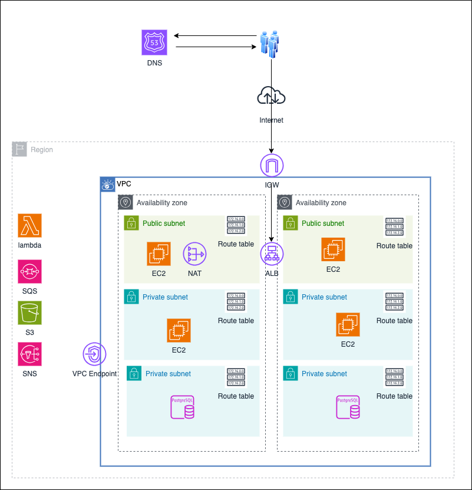

## Developer တွေသိထားသင့်တဲ့အခြေခံ AWS Network
အခုခေတ်မှာ development တိုင်းက Azure, AWS, GCP, Oracle, Alibaba အစရှိသဖြင့် cloud providers တွေကို သုံးလေ့ရှိကြတယ် အထဲမှာမှာ Amazon cloud က အသုံးများဆုံးဖြစ်လိမ့်မယ် အောက်မှာဆက်ပီး AWS သုံးတဲ့အခါ သိသင့်တဲ့အခြေခံ network concept တွေကို ရှင်းပြထားတယ်

### Region
Region ဆိုတာ data center တွေတကယ်ရှိတဲ့ နေရာတွေအလိုက်သတ်မှတ်ထားတာကို ဆိုလိုတာ ဥပမာ North America မှာဆိုရင် 
US East(N.Virginia), US East(Ohio), US West(N.California), Japan ဆိုရင် Asia Pacific (Tokyo) code အနေနဲ့ ap-northeast-1 , Asia Pacific(Osaka) ဆိုရင် code အနေနဲ့ ap-northeast-3 စသဖြင့် သုံးလေ့ရှိတယ်

### Availability Zone(AZ)
အပေါ် Region ထဲမှာ Availability Zone တွေထပ်ခွဲထားတယ်ဥပမာ Tokyo ဆိုရင်
ap-northeast-1a, ap-northeast-1b, ap-northeast-1c အစသဖြင့် ရှိကြတယ် US, Singapore, Canada Region အသီးသီးမှာလည်း သူ AZ တွေ အလိုက်ထပ်ပီးခွဲထားကြတယ်

### VPC(Virtual Private Cloud)
VPC က AWS မှာ သိကိုသိထားရမယ့်အစိတ်ပိုင်းဖြစ်တယ် VPC က virtual network ကိုဆိုလိုတာဖြစ်ပီး security, high availability 
အတွက် create လုပ်ကြတယ် isolate လုပ်ထားတဲ့အတွက် local network လိုသဘောမျိုးလည်းမြင်နိုင်တယ် VPC တွေကို တခုထက်ပိုပီး create လုပ်နိုင်သလို 
တခုခုတခုကိုလည်း ဆက်သွယ်ဖို့ connection တွေ ဖွင့်ထားနိုင်တယ် VPC တခုမှာ different AZ တွေပါနိုင်တယ် internet access ရဖို့ VPC တွေမှာ Internet Gateway (IGW)ကို create လုပ်ထားဖို့လိုတယ် 
VPC အထဲမှာတော့ local router ကိုသုံးပီး subnet တခုနဲ့တခု အချင်းချင်း communicate လုပ်နိုင်တယ် VPC တခုရဲ့ ip range ကို ဥပမာအားဖြင့် 10.0.0.0/16 လို့သတ်မှတ်နိုင်တယ်

### Subnet
ခဏက VPC ထဲမှာ AZ အလိုက် subnet တွေထပ်ခွဲနိုင်တယ် ဆိုလိုတာက VPC ရဲ့ ip group ထဲမှာမှ 
နောက်ထပ် ip group တွေ ထပ်ခွဲထားတာကို ဆိုလိုတာ Subnet တွေကို private Subnet, public Subnet တွေခွဲထားလေ့ရှိတယ် 
public , private တွေ ခွဲထားတာက ပိုပီး security , scalability ကောင်းစေတယ် ဥပမာအပြင် internet ကနေဘယ်သူမဆို access လုပ်မယ့် web server , load balancer တွေကို public subnet မှာထားပီး အပြင်က end user တွေထိဖို့ မလိုအပ်တဲ့ application server , database server တွေကို private မှာထားတဲ့အခါ မလိုအပ်တဲ့ security thread တွေကို prevent လုပ်ပီးသားဖြစ်တယ်  public မှာ ရှိတဲ့ service တွေကို အပြင်ကနေ access လုပ်လို့ရအောင် ဖွင့်ပေးထားပေးမယ့် private subnet တွေကတော့ အပြင်ကနေ access လုပ်လို့မရအောင် deny လုပ်ထားလေ့ရှိတယ် နောက်ပီးသူအပိုင်းနဲ့ သူ scale up လုပ်လို့ရတော့ ပိုပီး scalability ပိုကောင်းတယ်

### CIDR Block
CIDR block ဆိုတာဟာVPC,Subnet တွေရဲ့  ip address ranges တွေသတ်မှတ်ပီး group တွေခွဲထားကို ဆိုလိုတယ် 
ဥပမာ VPC ရဲ့ CIDR Block ကို 10.0.0.0/16 လို့သတ်မှတ်ထားရင် သူ့ subnet A ရဲ့CIDR Block ကို 10.0.0.0/24 နဲ့ subnet B ရဲ့ CIDR Block ကို 10.0.1.0/24 အစရှိသဖြင့် သတ်မှတ်ထားနိုင်တယ်အဲဒီကြောင့် subnet A က prefix /24 ဖြစ်တဲ့အတွက် သူရဲ့ ip address range သည် 10.0.0.0 ကနေ 10.0.0.255 ဖြစ်တယ် Subnet B သည် 10.0.1.0 ကနေ 10.0.1.255 ဖြစ်တယ်

### IP address, Prefix
IP Address မှာ IPv4 နဲ့ IPv6 ရှိပေမယ့် မတူတာက IPv6 တွေဟာ public ဖြစ်ပီး global unique ဖြစ်တယ် ဒီမှာတော့ IPv4 အကြောင်းဘဲ့ပြောမှာပါ IPv4 Address ဆိုရင် 0ကနေ255 အတွင်း range ရှိတဲ့ ဂဏန်းလေးလုံးပါတယ်  IPv4 က 32bit ဘဲ့ ရှိပီး IPv6 ကတော့ 128bit ဖြစ်တယ် IPv4 မှာဆိုရင် ဂဏန်းတလုံးဆီမှာ 8bits ရှိပီး ဂဏန်းလေးလုံးပါတဲ့အတွက် 32bits ရှိပါတယ် ဥပမာ 192.168.56.212 ဆိုရင် 192 က
192 = 128+64 = 2^7 + 2^6
192 ကို Bits အနေနဲ့ပြောင်းရင်11000000ရတယ် ခဏက 2^7 + 2^6 တန်ဖိုးတွေသည် 1 ဖြစ်ပီး 2^5 ကနေစပီး 2^0 အထိ ကျန်တာက 0 မို့ပါ
VPC ဘဲ့ဖြစ်ဖြစ် Subnet တွေဖြစ်ဖြစ် သူ့အနောက်မှာ prefix တွေပါ တူတူသတ်မှတ်ပေးရတယ် prefix ဆိုတာ /8 /16 /24 စတာတွေကို ပြောတာ ဥပမာ 10.10.0.0/16 သည် ဂဏန်းလေးလုံးရဲ့ 32bits မှာ ပထမ 8bits နှစ်လုံးက network ဖြစ်ပီး ကျန်နှစ်လုံးက host ဖြစ်တယ် prefix /16 မှာ 32-16=16 ရတဲ့ အတွက် 8bits x 2 = 16bits လို့ တွက်လို့ရတယ်
အဲဒီတော့ ဒီ range မှာ ရနိုင်တဲ့ network မပါဘဲ့ အနောက်က host နှစ်နေရာတွေ မှာ 2^16 = 65536 နေရာ ip addresses တွေရနိုင်တယ် prefix  /24 ဆိုရင် ပထမသုံးလုံး 24 bits က network ဖြစ်ပီး ကျန်တဲ့ 8bits က host နေရာ ဖြစ်တယ်  တခုသိထားရမှာက Subnet တွေမှာ ပထမဆုံး ip address လေးလုံးနဲ့ နောက်ဆုံးတလုံးက AWS က ယူထားတဲ့ ip address တွေဖြစ်တဲ့အတွက်ကိုယ်သုံးလို့မရနိုင်ဘူး 